# Creating Techzone Collection

This blog explains about how to create Techzone collection

## Steps

1. Click on `My library > My Create Collections` 

2. Click on `Share Your Content` 

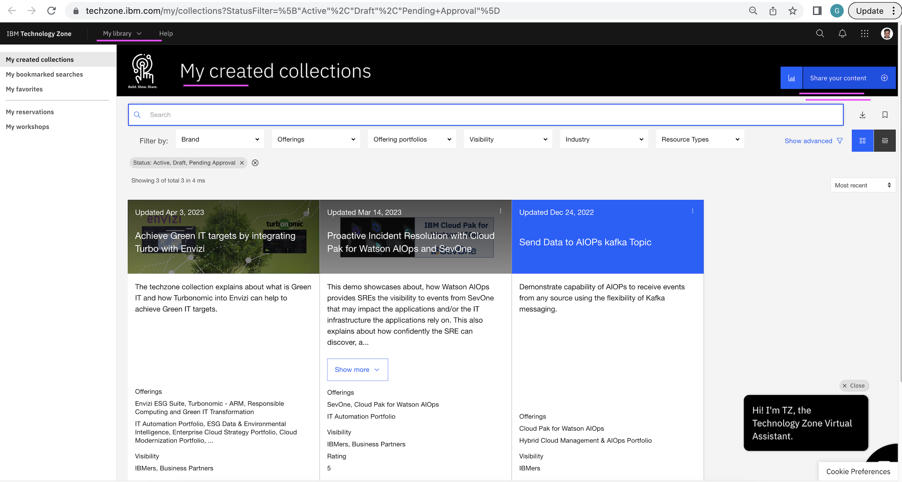

3. Click on `I Agree` 

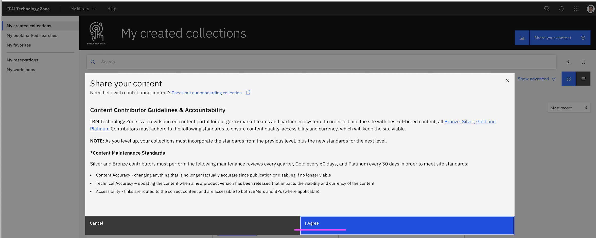

4. Enter the highlighted field values.

5. Click on `Add a Resources` to add your tile for your assets/blogs/links/videos/etc

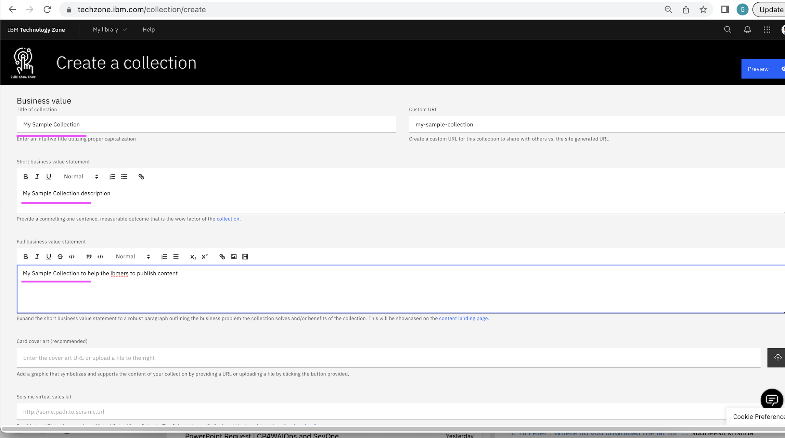
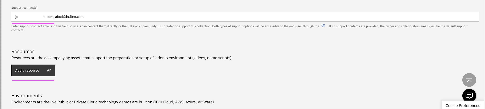

6. Enter the highlighted field values for your first tile.

- Resource Title : Title for your asset
- Short Businesss Value Statement : Description of your asset
- Resource Type : Can be a link, which points to your asset.
- Resource URL : URL of your asset.

7. Click on `Save`

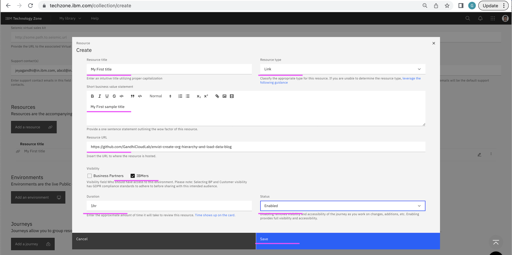

8. Click on `Resources` again to add second tile

9. Enter the highlighted field values for your second tile.
10. Click on `Save`

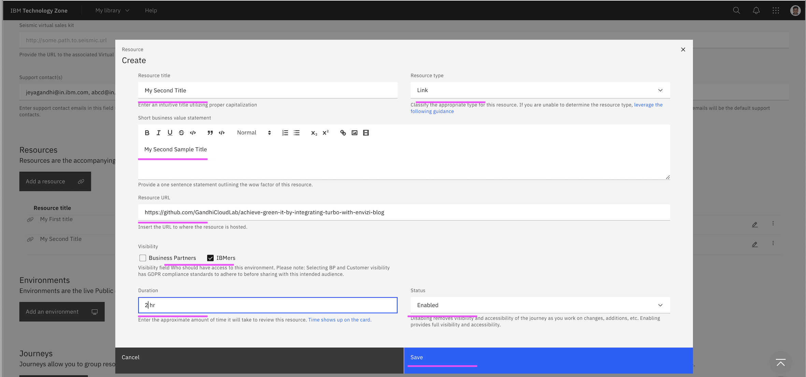

11. Tiles got added like this.
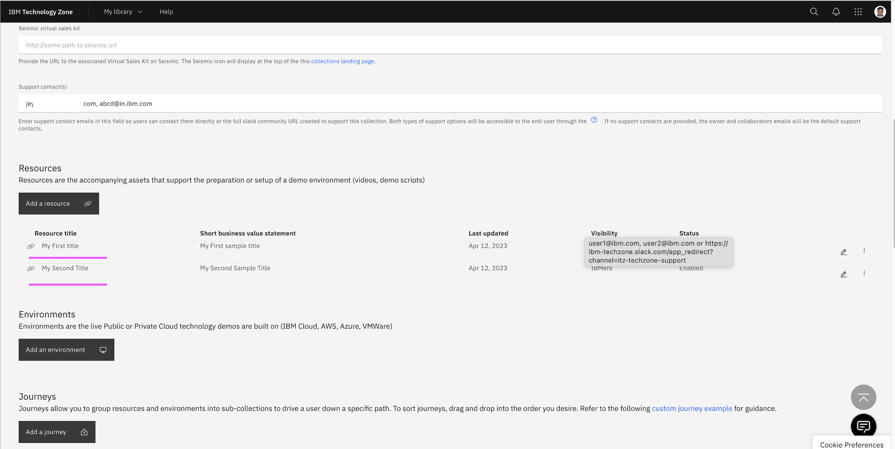

12. Continue entering highlighted field values for your collection.

- Collection Status : Keep it as `Draft` until you verify entire content.

13. Click on `Save`

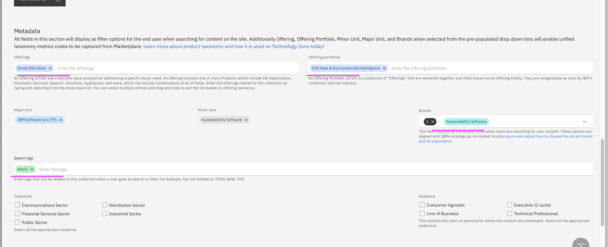
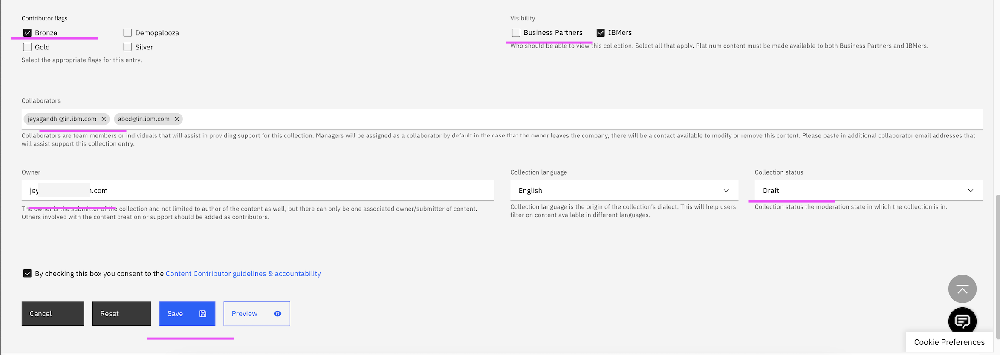

14. Goto `My library > My Create Collections` 

The newly create collection should be available.

15. Click on the collection tile

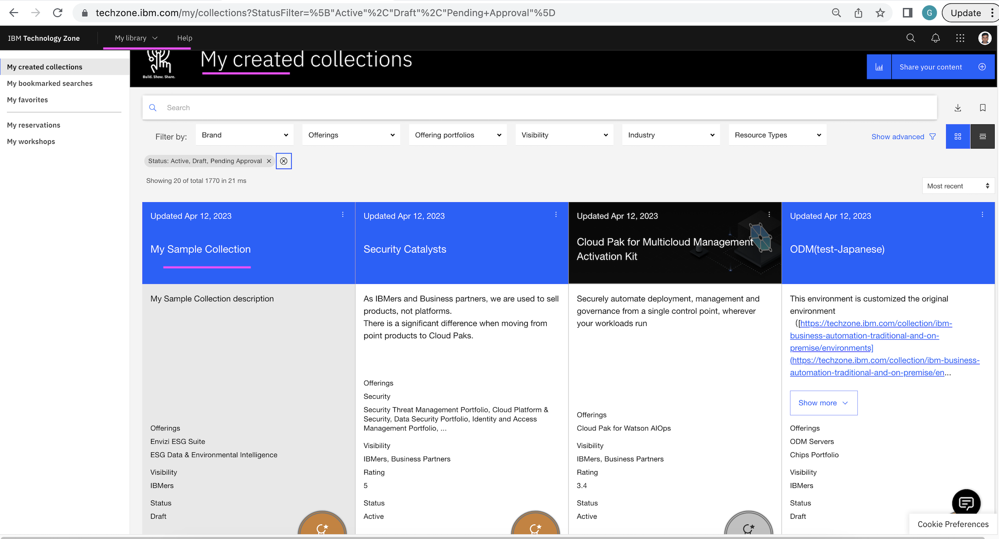

It opens the collection

15. Click on the  `Resources`

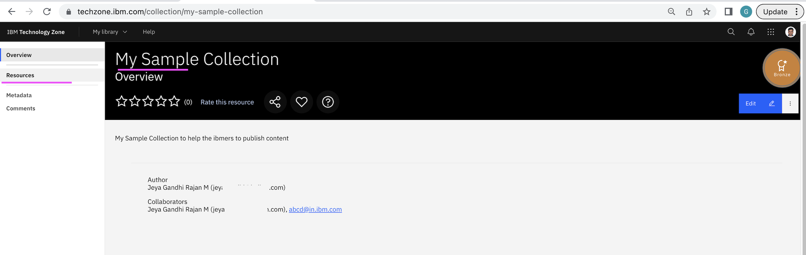

It opens tiles you created. 

Click on any of the tile and see the content.

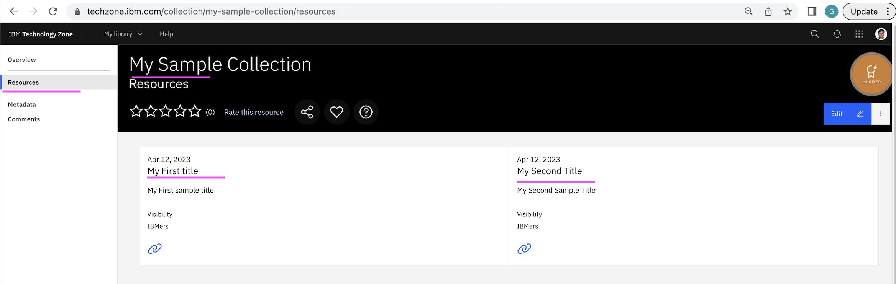
